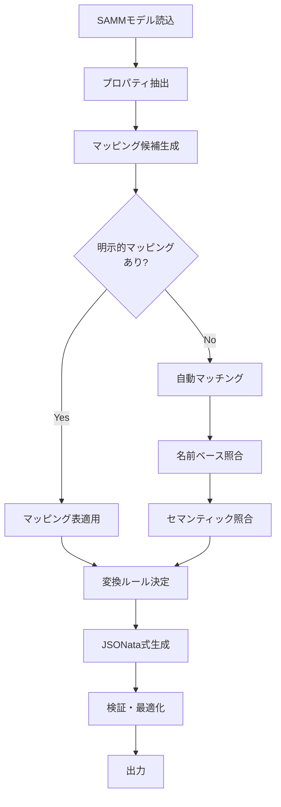

調査資料を確認しました。SAMMモデルからJSONata変換ルールを自動生成するための仕様書を作成します。

# SAMMモデルベースJSONata変換ルール生成仕様

## 1. 概要

本仕様は、ソース・ターゲット両方のSAMM（Semantic Aspect Meta Model）アスペクトモデルから、JSONインスタンス間の変換を行うJSONata式を自動生成するためのルールと手順を定義する。

## 2. 入力情報

### 2.1 必須入力
```yaml
inputs:
  source_aspect_model:
    type: SAMM_TTL  # Turtle形式のSAMMモデル
    properties:
      - property_uri
      - samm:preferredName
      - samm:dataType
      - samm:characteristic
      - samm-c:unit (オプション)
      - samm:description (オプション)
  
  target_aspect_model:
    type: SAMM_TTL
    properties: # 同上
  
  mapping_table:  # オプション：明示的マッピング定義
    type: SSSOM | CSV | JSON
    schema:
      - source_property: URI or path
      - target_property: URI or path
      - mapping_confidence: 0.0-1.0
      - transformation_type: [direct, unit_conversion, type_cast, formula]
      - transformation_params: {} # 変換パラメータ
```

### 2.2 補助情報（オプション）
- 単位換算表（unit_conversion_table）
- データ型キャスト規則（type_cast_rules）
- カスタム変換関数定義（custom_functions）

## 3. 処理フロー



## 4. マッピング決定アルゴリズム

### 4.1 マッチング優先順位

```javascript
matching_priority = [
  {
    level: 1,
    method: "explicit_mapping",
    condition: "mapping_table内に定義あり",
    confidence: 1.0
  },
  {
    level: 2,
    method: "characteristic_match",
    condition: "samm:characteristic URIが完全一致",
    confidence: 0.9
  },
  {
    level: 3,
    method: "preferred_name_match",
    condition: "samm:preferredName（正規化後）が一致",
    confidence: 0.8
  },
  {
    level: 4,
    method: "property_uri_match",
    condition: "プロパティ識別子（ローカル名）が一致",
    confidence: 0.7
  },
  {
    level: 5,
    method: "semantic_similarity",
    condition: "description類似度 > 閾値（0.6）",
    confidence: 0.6
  }
]
```

### 4.2 変換タイプ判定

```python
def determine_transformation_type(source_prop, target_prop):
    """
    SAMMプロパティ情報から必要な変換タイプを判定
    """
    transformations = []
    
    # 1. データ型チェック
    if source_prop.dataType != target_prop.dataType:
        transformations.append({
            "type": "type_cast",
            "from": source_prop.dataType,
            "to": target_prop.dataType
        })
    
    # 2. 単位チェック
    if (source_prop.unit and target_prop.unit and 
        source_prop.unit != target_prop.unit):
        conversion_factor = get_unit_conversion(
            source_prop.unit, 
            target_prop.unit
        )
        transformations.append({
            "type": "unit_conversion",
            "from_unit": source_prop.unit,
            "to_unit": target_prop.unit,
            "factor": conversion_factor
        })
    
    # 3. 構造変換チェック（ネスト、配列等）
    if source_prop.is_collection != target_prop.is_collection:
        transformations.append({
            "type": "structure_transform",
            "operation": "wrap" if target_prop.is_collection else "unwrap"
        })
    
    # 4. 変換不要（直接マッピング）
    if len(transformations) == 0:
        transformations.append({"type": "direct"})
    
    return transformations
```

## 5. JSONata式生成ルール

### 5.1 基本パターン

```javascript
// パターン1: 直接マッピング（同名・同型）
{
  "source.propertyName": "propertyName",
  "target.propertyName": "propertyName",
  "jsonata": "$.propertyName"
}

// パターン2: 名前変更のみ
{
  "source.propertyName": "isMoving",
  "target.propertyName": "inMotion",
  "jsonata": "$.isMoving"
}

// パターン3: 型変換
{
  "source.propertyName": "speedString",
  "source.dataType": "xsd:string",
  "target.propertyName": "speed",
  "target.dataType": "xsd:float",
  "jsonata": "$number($.speedString)"
}

// パターン4: 単位変換
{
  "source.propertyName": "drillHeadSpeed",
  "source.unit": "unit:kilometrePerHour",
  "target.propertyName": "speedMetersPerSecond",
  "target.unit": "unit:metrePerSecond",
  "jsonata": "$round($.drillHeadSpeed * 0.27778, 2)"
}

// パターン5: ネスト構造変換
{
  "source.path": "address.city",
  "target.path": "location.town",
  "jsonata": "$.address.city"
}

// パターン6: 配列処理
{
  "source.propertyName": "measurements",
  "source.is_collection": true,
  "target.propertyName": "readings",
  "jsonata": "$.measurements[$number(value) > 0]"
}
```

### 5.2 複合変換パターン

```javascript
// 複数フィールドからの計算
{
  "sources": ["width", "height"],
  "target": "area",
  "jsonata": "$.width * $.height"
}

// 条件分岐
{
  "source": "temperature",
  "target": "status",
  "jsonata": "$.temperature > 100 ? 'hot' : 'normal'"
}

// 配列集約
{
  "source": "values",
  "target": "average",
  "jsonata": "$sum($.values) / $count($.values)"
}
```

## 6. 完全なJSONata変換式の生成

### 6.1 トップレベル構造

```javascript
{
  // 生成されるJSONata式の全体構造
  "transformation": {
    // シンプルなマッピングはトップレベルに展開
    "targetField1": "$.sourceField1",
    "targetField2": "$number($.sourceField2)",
    
    // ネストされたオブジェクト
    "nestedObject": {
      "field1": "$.source.nested.field1",
      "field2": "$round($.source.nested.field2 * 1000)"
    },
    
    // 配列変換
    "items": "$.sourceItems.{
      'id': itemId,
      'name': itemName,
      'price': $number(itemPrice)
    }"
  }
}
```

### 6.2 生成アルゴリズム

```python
def generate_jsonata_expression(mappings):
    """
    マッピング情報からJSONata式を生成
    """
    result = {}
    
    for mapping in mappings:
        target_path = mapping.target_path
        source_path = mapping.source_path
        
        # 変換式を構築
        expression = build_expression(
            source_path=source_path,
            transformations=mapping.transformations
        )
        
        # ネスト構造を考慮してresultに追加
        set_nested_value(result, target_path, expression)
    
    return jsonata_format(result)

def build_expression(source_path, transformations):
    """
    変換タイプに応じた式を構築
    """
    expr = f"$.{source_path}"
    
    for transform in transformations:
        if transform.type == "type_cast":
            expr = apply_type_cast(expr, transform)
        elif transform.type == "unit_conversion":
            expr = apply_unit_conversion(expr, transform)
        elif transform.type == "formula":
            expr = apply_formula(expr, transform)
    
    return expr

def apply_type_cast(expr, transform):
    """型変換関数を適用"""
    cast_map = {
        "xsd:string": f"$string({expr})",
        "xsd:integer": f"$number({expr})",
        "xsd:float": f"$number({expr})",
        "xsd:double": f"$number({expr})",
        "xsd:boolean": f"$boolean({expr})",
        "xsd:decimal": f"$number({expr})"
    }
    return cast_map.get(transform.to, expr)

def apply_unit_conversion(expr, transform):
    """単位換算を適用"""
    factor = transform.factor
    precision = transform.get("precision", 2)
    return f"$round({expr} * {factor}, {precision})"
```

## 7. 出力フォーマット

### 7.1 生成される成果物

```json
{
  "metadata": {
    "generator": "SAMM-to-JSONata Generator v1.0",
    "generated_at": "2025-10-07T10:30:00Z",
    "source_model": "SourceAspectModel.ttl",
    "target_model": "TargetAspectModel.ttl",
    "mapping_confidence_avg": 0.85
  },
  
  "mappings": [
    {
      "source_property": ":isMoving",
      "target_property": ":inMotion",
      "mapping_method": "preferred_name_match",
      "confidence": 0.8,
      "transformations": ["direct"],
      "jsonata_fragment": "$.isMoving"
    },
    {
      "source_property": ":drillHeadSpeed",
      "target_property": ":speedMetersPerSecond",
      "mapping_method": "characteristic_match",
      "confidence": 0.9,
      "transformations": ["unit_conversion"],
      "jsonata_fragment": "$round($.drillHeadSpeed * 0.27778, 2)"
    }
  ],
  
  "complete_transformation": {
    "inMotion": "$.isMoving",
    "speedMetersPerSecond": "$round($.drillHeadSpeed * 0.27778, 2)",
    "location": {
      "town": "$.address.city"
    }
  },
  
  "unmapped_properties": {
    "source": [":propertyWithoutMatch"],
    "target": [":unusedTargetProperty"]
  },
  
  "warnings": [
    {
      "type": "low_confidence",
      "property": ":ambiguousProperty",
      "message": "Mapping confidence below threshold (0.65)",
      "suggestion": "Manual review recommended"
    }
  ]
}
```

## 8. 検証・品質保証

### 8.1 検証項目

```yaml
validation_rules:
  - rule: syntax_check
    description: 生成されたJSONata式の構文検証
    tool: jsonata.parser
    
  - rule: type_safety
    description: データ型の互換性チェック
    check: source型 → target型への変換可能性
    
  - rule: unit_consistency
    description: 単位換算の妥当性確認
    check: 換算係数が定義されているか
    
  - rule: completeness
    description: すべてのtargetプロパティがマップされているか
    threshold: 90%  # カバレッジ閾値
    
  - rule: confidence_threshold
    description: マッピング信頼度の確認
    minimum: 0.6
```

### 8.2 テストケース生成

```javascript
// サンプルデータでのテスト実行
{
  "test_cases": [
    {
      "name": "basic_mapping_test",
      "source_instance": {
        "isMoving": true,
        "drillHeadSpeed": 100.0
      },
      "expected_target": {
        "inMotion": true,
        "speedMetersPerSecond": 27.78
      },
      "jsonata_expression": "{ ... }"
    }
  ]
}
```

## 9. 実装推奨事項

### 9.1 段階的アプローチ

```
Phase 1: 基本マッピング
- 直接マッピング（名前一致）
- 単純な型変換

Phase 2: 高度な変換
- 単位換算
- ネスト構造変換
- 配列処理

Phase 3: AI支援
- LLMによる意味的マッチング
- 変換式の最適化提案
```

### 9.2 エラーハンドリング

```javascript
error_handling_strategy = {
  "no_match_found": "警告を出力し、手動マッピングを促す",
  "ambiguous_match": "複数候補を提示し、ユーザー選択を求める",
  "invalid_transformation": "デフォルト変換（type cast）を試行",
  "missing_unit_conversion": "係数なしの警告付きで直接マッピング"
}
```

## 10. 拡張可能性

- カスタム変換関数の追加機能
- ドメイン特化ルールの組み込み
- 機械学習によるマッピング精度向上
- リアルタイムフィードバック機構

---

この仕様書に基づいて実装を進めることで、SAMMモデルからJSONata変換ルールを体系的に生成できます。実装時には、具体的なSAMMモデルの例でテストしながら段階的に機能を拡充することを推奨します。